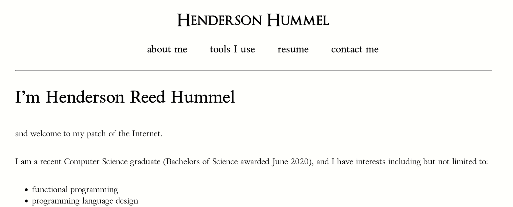

# Building this site

published: 2024-08-28

This site is, as of yesterday, feeling quite close to "done". And so, I thought I would take a moment to describe how this site is built, some of my design and technical decisions, and maybe do a little storytelling along the way.

Why don't we start with the storytelling?

## Let's begin at the right place: the start.

My first website was handrolled HTML and CSS, hosted on the university servers, at `~hhummel`. I still have (most of) the source live ([you can go browse it, if you want.](/old-site/)

It is, as you can see, quite sparse, in an semi-emulation of [prof. dr style.](http://contemporary-home-computing.org/prof-dr-style/)

This actually was a delightful time, and I remember being very happy with the site as it was. But of course, I needed more *features*.

## site two:

This is when I wrote my first static site generator, [hatchet](https://gitlab.com/hendersonreed/hatchet). That project was built, believe it or not, as a class project for a functional programming course. 

Well, maybe you can tell it was built when I was very into functional programming:

As you can see, I was very into LaTeX and tried to evoke a similarly academic feeling with the visual design here. I don't really know what I was going for, but I definitely wanted to seem *professional*, whatever that meant.

But disregarding my questionable design choices, the technology behind the site was extremely minimal - `hatchet` had no more sophistication than a bash script that used `pandoc` and `cat` to generate each page. It had some bugs, it was very minimal, and importantly, *it was built without my final usecase in mind.*

That is reasonable considering my experience at the time, and the fact that I wasn't even sure what I would be doing with the site. And I was excited about Haskell and my newfound interest in functional programming. But nonetheless, I put much more thought into writing the tool than I did into making the site easy to write for, deploy, maintain, etc etc. A tale as old as time.

This site was, after I lost access to my old uni account, hosted on a Linode server that I paid $10 a month for (not to mention domain fees!) And of course, deployment was at first very manual (building the site locally, `sftp`-ing the files to the server.)

Eventually I built a continuous delivery cronjob that polled the GitHub repository and downloaded any changes, rebuilding the site. I was rolling *everything* myself. It was... unmaintainable. After building an Ansible playbook to deploy the site (right after I got hired into the Ansible org at Red Hat), it still wasn't easy or fun and I gave up, and the site saw little-to-no updates for probably two years.

## site three (this one):

In August of 2023, I began my batch at the Recurse Center. I was excited and fired up to re-write my entire personal website. And I knew better than I did before: I knew that updating the site had to be easy for me to actually write. The tools to build the site had to be portable (because I knew that getting dependencies into CI systems can be a real pain.) I was feeling more playful than professional, and so I wanted the visual design of site to reflect that. And I wanted to move to static site hosting that was safer, free, and easier to deploy to.

My goals with the new site were straightforward:

1. build the simplest thing that did the job.
2. deploy on Github Pages.
3. use as few dependencies as possible.

So, [psg](https://github.com/hendersonreed/psg) was born (I've written on it [before](https://henderson.lol/pages/hire/psg.html). It is, like `hatchet`, roughly as unsophisticated as a bash script that uses `pandoc` and `cat`. But there are a few things that, to me, make it better:

- no Python dependencies (i.e. it only relies on the python3 standard library.)
    - this means I don't need to think about packaging, pyproject.toml, pip, venv, wheels, etc etc. It's just a script.
- only one system dependency (`pandoc`.)
- easy to maintain (85 lines of vanilla Python.)
- uses an extremely simple mental model (jamming the converted markdown between an HTML header and footer.)

As a result of that last point, it's *also* extremely easy to write effective and hacky scripts that post-process your site. I've done this a lot, and you can see them [here.](https://github.com/hendersonreed/hendersonreed.github.io/tree/master/tools/) These scripts do things like generate an ATOM feed, the blog index, my site map (which I've recently updated to no longer require `tree`, another system dependency (I did this by writing my own `tree` replacement in python and shipping it with the site...))

But, the reason I'm writing this post is because of the very last feature I've added, and I think in many ways, the *final feature*: **true continuous delivery**. This means I can now edit this site *from my phone* by editing source markdown through the GitHub web interface. Once it's committed, through the magic of GitHub Actions, the site is built and deployed. You can see the file that does the magic [here.](https://github.com/hendersonreed/hendersonreed.github.io/blob/master/.github/workflows/build-and-deploy-site.yml)
