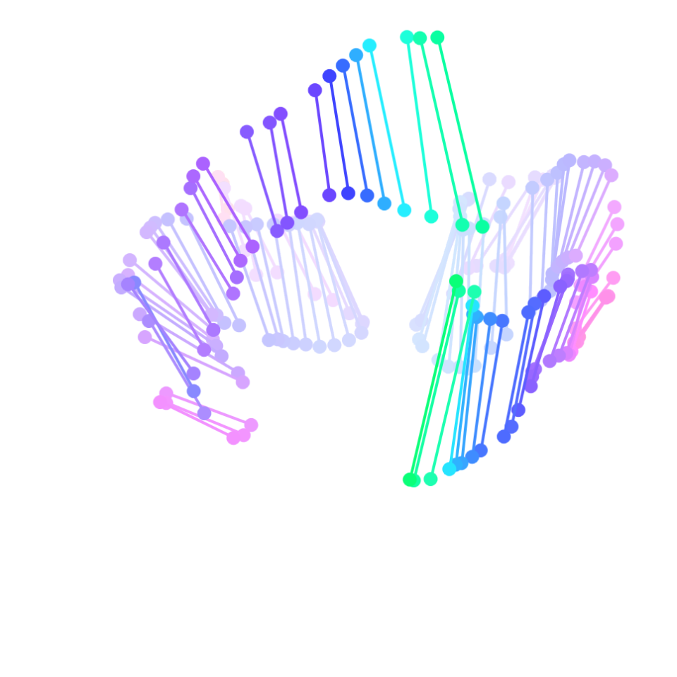
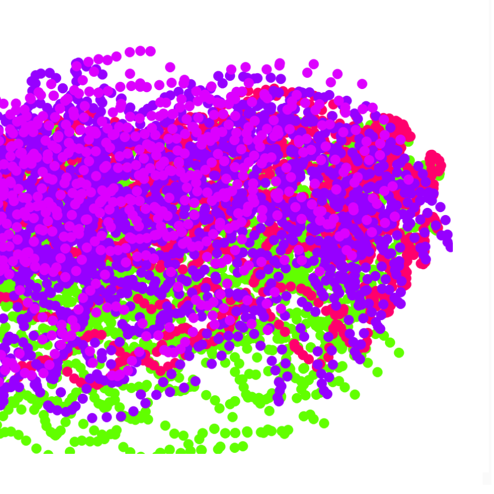
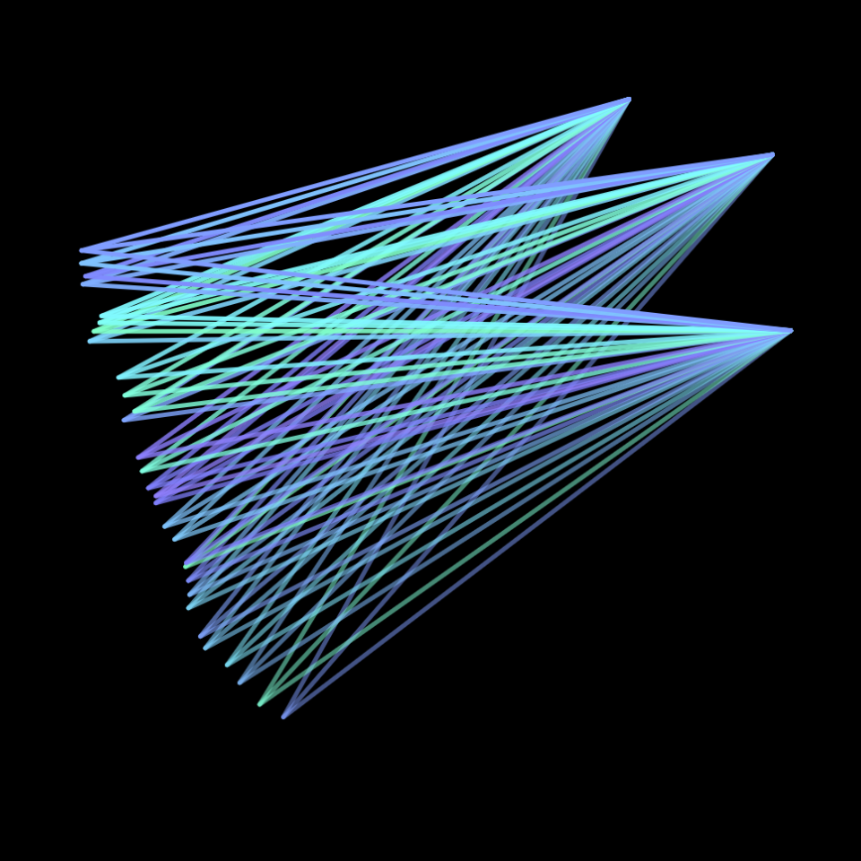
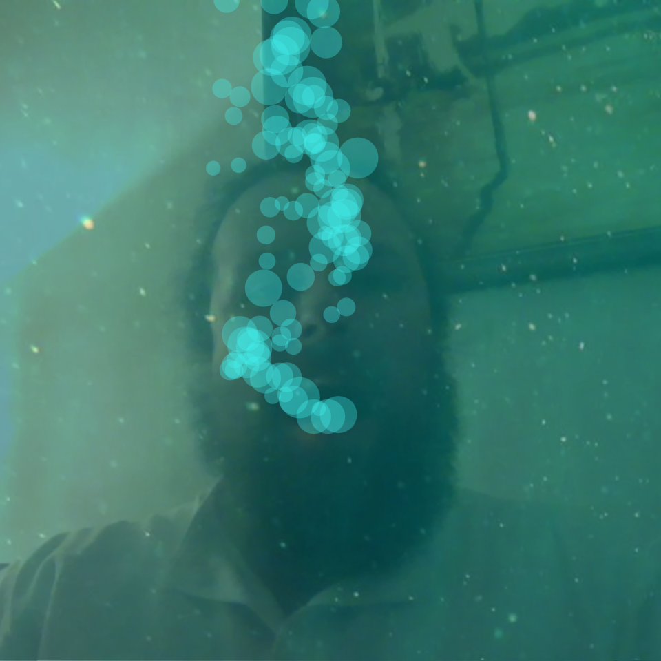

# Webcam Toys

I've been playing around for a long-time with webcams.

Turns out that small neural networks + WASM + computer vision means that we can do all kinds of *crazy* stuff on the web, really easily. I've made a number of silly little things when I've had spare moments:

- some demos of the technology in its most basic forms:
    - [one](demo1/) (tracks your hands - try hitting `t` to toggle your camera feed on-and-off)
    - [two](demo2/) (tracks your hands - try hitting `t` and `c` to toggle camera feed and color.)
    - [three](demo3/) (tracks your face)
- a few more artistic things:
    - [one](hand-brush/)
    - [two](triangle-zone/)
- [a goofy "underwater webcam" that plays bubble noises and animates bubbles when your mouth is open.](bubble-face)
- a [webcam theremin](webcam-theremin/), where the distance between your index-finger and thumb on both hands controls the volume and pitch of a sound being played.

<!--
-->
<!--  <a href="webcam-theremin/">-->
<!--    -->
<!--    
webcam-theremin
-->
<!--  </a>-->
<!--  <a href="hand-brush/">-->
<!--    -->
<!--    
hand-brush
-->
<!--    
hand-brush
-->
<!--  </a>-->
<!--  <a href="triangle-zone/">-->
<!--    -->
<!--    
triangle-zone
-->
<!--  </a>-->
<!--  <a href="bubble-face/">-->
<!--    -->
<!--    
bubble-face
-->
<!--  </a>-->
<!--
-->
